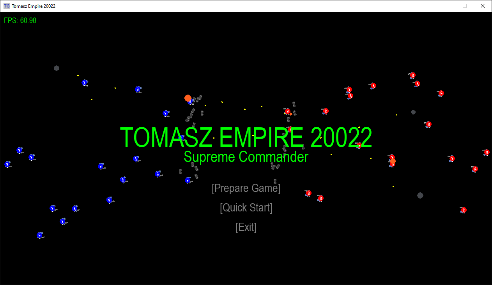
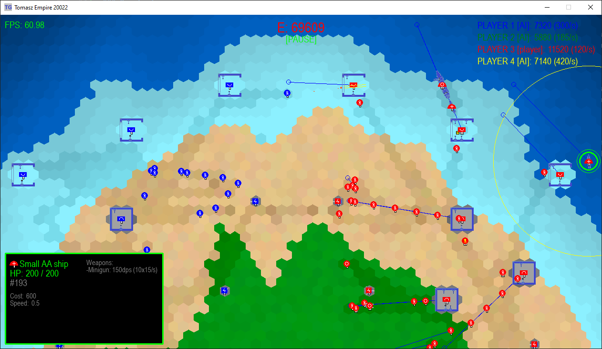
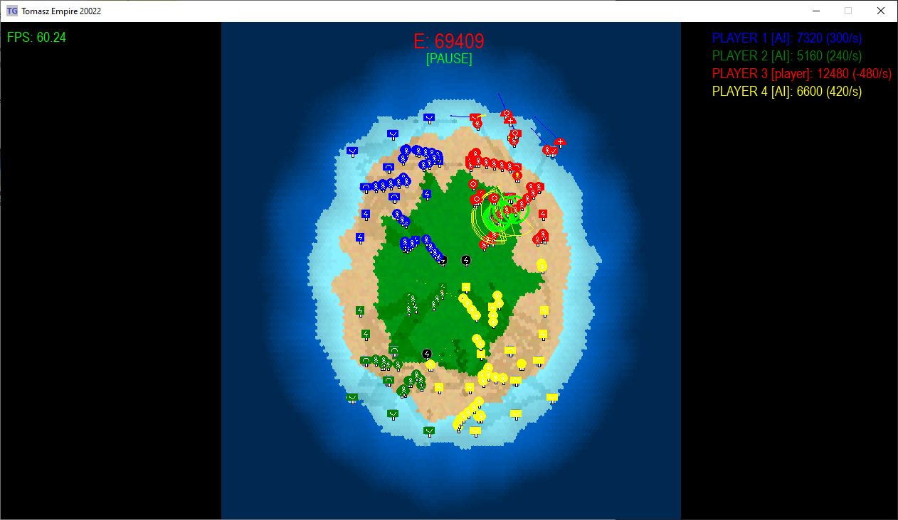

# Tomasz Empire 20022: Supreme Leader

  

## About
**'Tomasz Empire 20022: Supreme Leader'** is another part of the story about my Empire! The Future &amp; RTS - this is where the fun begins!!! 

In this gripping battle for supremacy, you'll command armies not only on land but also in the skies and on the open seas, offering a unique and immersive experience that challenges your strategic skills.

**Project still under development**

### Key Features:

**Procedurally generated maps:**
Navigate ever-changing landscapes with procedurally generated maps, ensuring each battle is a unique challenge that demands adaptability and strategic ingenuity from commanders. The dynamic world guarantees a fresh and unpredictable experience, keeping the thrill of strategy at the forefront of every engagement.

**On water, land and in the air:**
Build and command a diverse array of units, each specialized for different environments. From powerful ground forces and formidable air squadrons to naval fleets equipped with advanced weaponry, assemble a balanced army capable of dominating any front. Experiment with unit combinations to create the ultimate force for your playstyle.

**Three generations of units**
From modern army to cutting-edge more and more futuristic technology, strategically deploy a diverse array of units across land, air, and water to dominate your opponents with evolving tactical depth. Commanders must skillfully combine the strengths of 3 generations to forge an unstoppable force and secure victory across the dynamic battlefield.

  

### Current stage:
v0.16 - Planes stage II

### Last changes:
v0.16.0 - 11.03.2024

* New unit: Aircraft_carrier;
* New fuel consumption mechanics for aircraft.

v0.15.5 - 14.01.2024
* Minor changes;
* Code cleaning.

v0.15.4 - 30.12.2023
* Fixes in pathfinding algorithm regarding units leaving the map.

v0.15.3 - 29.12.2023
* Fix of critical bug in the building queue;
* Lot of changes in Size Choose Scene:
    * fixed choose shape option,
    * added currently selected map dimensions,
    * added new trees option;  
* Lot of small fixes.

v0.15.2 - 17.12.2023
* Fixes in start position on bridge map;
* New algorythm for finding places for naval factories.

  
   
  
   
  

