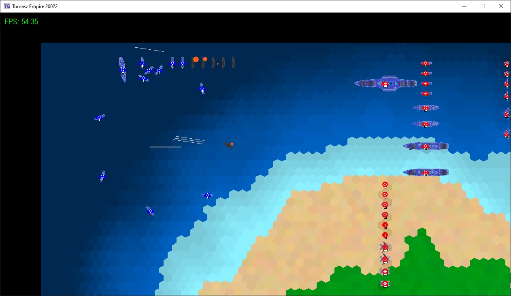

# Tomasz Empire 20022: Supreme Leader

  

## About
**'Tomasz Empire 20022: Supreme Leader'** is another part of the story about my Empire! The Future &amp; RTS - this is where the fun begins!!!

**Project still under development**

### Current stage:
v0.15 - Map stage III

### Last changes:
v0.15.4 - 30.12.2023

* Fixes in pathfinding algorithm regarding units leaving the map.

v0.15.3 - 29.12.2023

* Fix of critical bug in the building queue;
* Lot of changes in Size Choose Scene:
    * fixed choose shape option,
    * added currently selected map dimensions,
    * added new trees option;  
* Lot of small fixes.

v0.15.2 - 17.12.2023

* Fixes in start position on bridge map;
* New algorythm for finding places for naval factories.

v0.15.1 - 09.12.2023

* New algorythm for finding places for land factories;
* New algorythm for finding places for generators.

  
   
  

