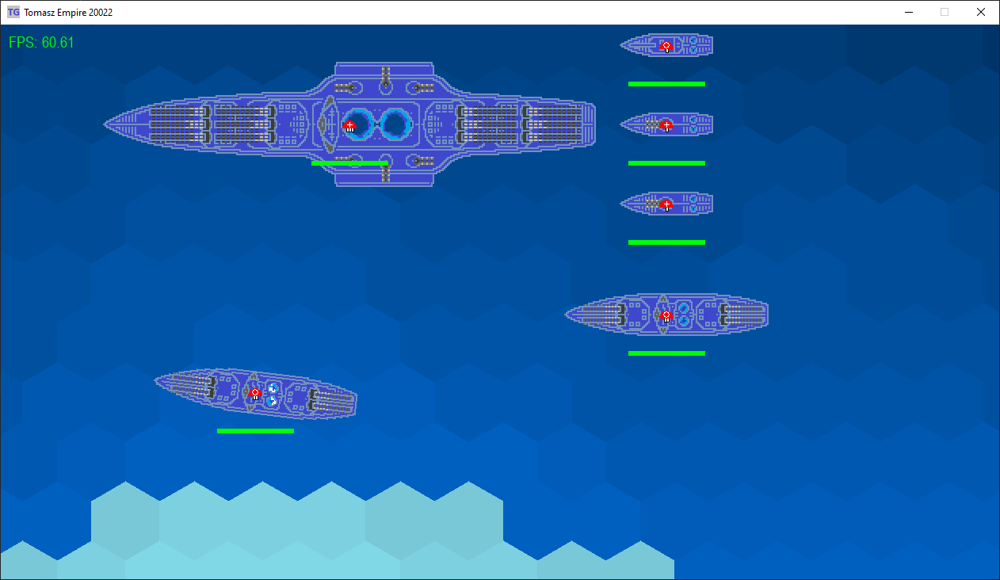

# Tomasz Empire 20022: Supreme Leader

  

## About
**'Tomasz Empire 20022: Supreme Leader'** is another part of the story about my Empire! The Future &amp; RTS - this is where the fun begins!!!

**Project still under development**

### Current stage:
v0.12 - AI, performance optimization and game balance

### Last changes:
v0.12.2 - 10.04.2023

* New loop button in queue window;
* Building queue can be now looped;

v0.12.1 - 02.04.2023

* New HexTile: submerged_concrete;
* Added concrete buildings foundation - pathfinding algorithm will be avoiding them;
* Changes for Space Marine units' AI - if building found, stop the unit in front of that building.

v0.12.0 - 01.04.2023

* Added new pathfinding algorithm. Units now avoid terrain they cannot pass through.

  
   
  

